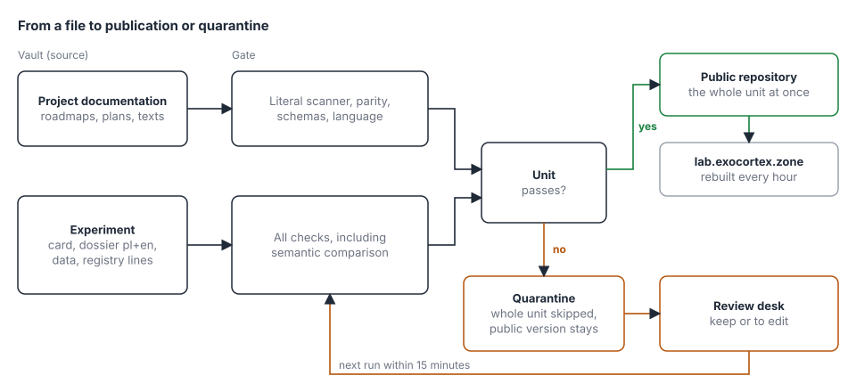

# Publication classes, quarantine and the review desk

This document describes how to change the publisher so that holding one file does not block the rest, and so that nobody has to review held items inside notes. The tasks are in [F1](roadmap/F1-public-repo.md), from [F1.11](roadmap/F1/F1.11-publication-classes.md) to [F1.15](roadmap/F1/F1.15-gate-desk.md). The gate is described in [F0](roadmap/F0-leaks-and-gate.md) and the publisher in [F1.9](roadmap/F1/F1.9-continuous-publisher.md).

## What does not work today

The publisher checks each file on its own and holds the ones that fail. Three problems follow.

1. Project documentation (roadmaps, plans, the cycle description, the description of how the lab works) is checked the same way as experiment data. It is our own text about public things, and the semantic comparison with the private corpus flags it as similar because the topic overlaps. Today 20 files and 60 paragraphs wait like this.
2. An experiment is made of many files: the card, the dossier in two languages, the data and an entry in the preregistration registry. Holding one of them leaves half an experiment in the repository, for example data without a card or a registry entry without a description.
3. The review of held items is a page in Obsidian with dozens of paragraphs and checkboxes. It is hard to get through, and the decision still needs a job started by hand on the server.

## Two kinds of material

Every path gets a class from a list in the gate image, not from the vault, so a file cannot grant itself an exception. A path that is not on the list goes to the strictest class.

| Class | Paths (in pl and en) | Unit of publication | Checks |
|---|---|---|---|
| Project documentation | `01-cycle.md`, `02-roadmap.md`, `03-progress.md`, `04-how-it-works.md`, `05-publication-design.md`, `roadmap/**`, `templates/**`, `img/**` | a file with its language pair | literal scanner at the blocking level, parity, schemas, language |
| Experiment | `experiments/<slug>/**`, `data/<slug>/**`, entries in `prereg.jsonl` with that slug | the whole experiment | everything, including the semantic comparison and scanner warnings |
| Generated page | `generated/**` | a file with its language pair | same as an experiment |
| Unknown | any other path | a file | same as an experiment, plus an alarm in the notification |

## Unit of publication and the skip rule

A unit goes to the repository as a whole or not at all. If any file of a unit fails the checks, the publisher copies none of them, and the public version of the unit stays as it was. The other units go through as usual, in the same run and the same commit.

A few details protect this:

1. An experiment that lacks a required file, for example the version in the other language, or the card when there is a registry entry, is held with the reason `incomplete`.
2. The registry `prereg.jsonl` is a single file, so the publisher builds its public version from lines. It appends only the new lines whose units passed, at the end of the file. The rule "it only grows" stays: every published line must be in the source unchanged. The order in the file is the order of publication, and every line has its own freeze date, so the proof does not change.
3. Removing an experiment from the source removes it from the repository as a whole too, never in part.
4. The lab site builds only from what is public, so it always sees a consistent experiment or none.

## Exempting project documentation from security testing

Project documentation skips the semantic comparison, does not land on the review page and needs no paragraph approvals. This removes almost all of today's holds, because they are semantic.

Safeguards for this exception:

1. The list of classes and paths is in the gate image and changes only through a commit that passes CI.
2. The documentation class accepts only the extensions `.md` and `.svg`. A data file, a CSV or a script in such a path falls to the unknown class.
3. The directories `experiments/`, `data/`, `generated/` and the registry never belong to the documentation class.
4. The nightly self-test plants canaries in every class, documentation included. If the literal scanner stops catching them, the lock stops the publisher, as it does today.
5. The size of a documentation file is limited, and a file over the limit goes to the unknown class.

I recommend keeping the literal scanner at the blocking level for documentation as well. It is deterministic, it gives almost no false alarms (all of today's documentation holds are semantic) and it enforces the rule that names of private machines and clients do not reach public texts. Turning off every test is one line in the class list, but then nothing catches such a slip in text written by agents.

## Quarantine

The publisher records every hold in a quarantine database on the state volume. An entry holds only paths, rule names and paragraph hashes, never text.

| Field | Meaning |
|---|---|
| Unit | class and key, for example the experiment `intent-vs-fact` |
| Files | the paths covered by the entry |
| Findings | rule, path, paragraph hash, similarity score |
| State | open, kept, to edit, released or outdated |
| Source hash | a digest of the unit's content at the time of the entry |
| Decision trail | who, when, which decision, without text |

Life cycle: a new finding is open. The decision "keep" records the paragraph hash as approved, and "to edit" leaves the finding and notes what to fix. When the source changes, findings of older versions become outdated and only the changed paragraphs return to review. A unit is released when it has no open findings and no findings marked "to edit". The next publisher run releases it, that is within 15 minutes.

A literal finding, that is a hit on the name list or on personal data, cannot be approved. For such findings only "to edit" remains, as in the current review.

## The review desk

The desk is an ordinary web page that replaces the review in Obsidian. It runs as a Quadlet service on the gate server, next to the other units.

The home screen shows the queue of units: the name, the number of findings, the state and the age. Opening a unit starts a focus mode that shows one finding at a time: the public paragraph on the left and the three nearest protected paragraphs on the right, with links to the whole notes, the similarity score and the model's hint.

Every finding has two actions:

1. Keep (key `1`): records the paragraph approval.
2. To edit (key `2`): leaves the finding, notes it on the list of fixes and shows a link that opens the note in Obsidian.

After a decision the card collapses to one line with the outcome, and the desk moves to the next. The header shows progress, for example 14 of 60 and the number of items to edit. The `Backspace` key undoes the last decision, and `↓` skips an item without a decision.

Bulk approval works on two levels:

1. "Keep the whole experiment" and "keep the whole folder" approve all semantic findings of that unit or path with one click. Before writing, the desk shows a summary (the number of files, paragraphs and the highest similarity score) and asks for confirmation. The approval is tied to paragraph hashes, so a changed paragraph returns to review. If the unit has literal findings, the button is disabled and gives the reason.
2. A standing rule "always keep this folder" is optional. It requires a reason and an expiry date (90 days by default), it covers new paragraphs of the path as well, and it is visible on a separate rules screen where it can be revoked. It never covers literal findings. It is in effect a switch-off of the semantic comparison for a path, so every use is written to the decision trail.

Privacy and access: the service listens only on 127.0.0.1, port 8100, so access works like the rest of the gate server (a tunnel or a private network). It requires a token from a Podman secret and protects forms with a CSRF token. It loads nothing from outside, does not log request content, and its responses carry the header `Cache-Control: no-store`. Protected text is read from the index and the vault, read-only, and only for the duration of a response. Decisions go to the state volume, not to the vault.

## Taking sources out of protection

The semantic comparison sets public text against the protected corpus, that is the whole vault and the engine database outside the public folders. Own and non-sensitive notes (for example project descriptions or summaries of public sources) only produce false alarms. The desk lets you take them out of protection so that they are ignored.

1. Next to each of the three nearest protected paragraphs there are the actions "take the note out" and "take the folder out". The rules screen also lets you add a path by hand.
2. An exclusion needs a reason, may have an expiry date and works at once: simcheck skips the listed sources on every check, and the nightly index rebuild no longer reads them. Findings that rested only on excluded sources disappear from the queue.
3. A hard list of paths that cannot be excluded from the desk (client material, personal notes) is in the gate configuration. The button next to such a path is inactive and gives the reason.
4. The exclusion list lives on the state volume together with the decision trail: who, when, which path and the reason. Every exclusion can be revoked, and revoking restores the source at the next index rebuild and at once in checks.
5. The gate shows the number of active exclusions in its notification, so the list does not grow unnoticed.

## Deployment on the gate server

The new unit `exocortex-gate-desk.container` is a service that runs all the time, in the same pod as the others. It mounts the vault and the documents read-only, the index read-only and the state volume read-write, and takes the token from the secret `gate_desk_token`. Paragraph approvals move from the index volume to the state volume, and simcheck reads them from there, read-only. The `review` and `approve` jobs stay as an emergency path until the desk passes its trial, and are removed in F1.15.

## Changes in the code

| Module | Change |
|---|---|
| `tools/publisher/classes.py` (new) | the class list, path classification, the strictest class by default |
| `tools/publisher/core.py` | units of publication, skipping a whole unit, building the registry from lines, sets of checks per class |
| `tools/publisher/quarantine.py` (new) | the quarantine database, recording findings, states, reading decisions |
| `tools/simcheck/server.py` | the `/check` response returns paragraphs and scores, not only a boolean; it skips sources on the exclusion list |
| `tools/leakgate/selftest.py` | canaries in every class |
| `tools/gate/desk.py` (new) | the desk service: queue, focus mode, bulk decisions, rules, trail |
| `deploy/gate/` | the Quadlet unit, the secret, installation notes |

## Order of work

The tasks are in [F1](roadmap/F1-public-repo.md). First [F1.11](roadmap/F1/F1.11-publication-classes.md) and [F1.13](roadmap/F1/F1.13-docs-exemption.md), because they alone release the project documentation and the lab site gets its "How it works" text. Then [F1.12](roadmap/F1/F1.12-atomic-units.md) (whole experiments), [F1.14](roadmap/F1/F1.14-quarantine-store.md) (the quarantine database) and last [F1.15](roadmap/F1/F1.15-gate-desk.md) (the desk). Until F1.15, held experiments are reviewed as today, in Obsidian. After the desk, and only if more than about 20 items a day remain after the rollout, [F1.16](roadmap/F1/F1.16-review-assistant.md) adds an assistant that assesses findings and groups them into batches. The assistant only recommends.

## Owner decisions

1. The scope of the documentation exemption: only the semantic comparison (recommended) or every test. Decided on 29 September: only the semantic comparison. The literal scanner stays at the blocking level, and its warnings go to the run log. Switching off every test is one line in the class configuration and is not enabled.
2. Whether the standing rule "always keep this folder" should exist in the first version, or only after the first weeks of working with the desk.
3. Access to the desk: a tunnel to the gate server (recommended) or a private network with a token.
4. Generated pages (radar, candidate assessment, roadmap status) as a class like an experiment, or like documentation. Decided on 29 September: like an experiment.
5. The hard list of paths that cannot be taken out of protection from the desk (client material, personal notes).
