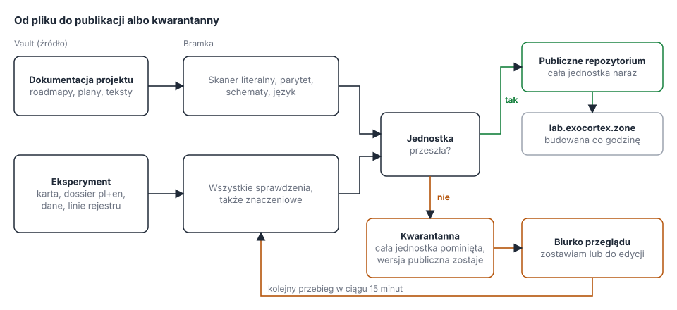

# Klasy publikacji, kwarantanna i biurko przeglądu

Ten dokument opisuje, jak zmienić publikator tak, żeby zatrzymanie jednego pliku nie blokowało reszty i żeby nikt nie musiał przeglądać zatrzymań w notatkach. Zadania do wykonania są w [F1](roadmap/F1-public-repo.md), od [F1.11](roadmap/F1/F1.11-publication-classes.md) do [F1.15](roadmap/F1/F1.15-gate-desk.md). Bramkę opisuje [F0](roadmap/F0-leaks-and-gate.md), a publikator [F1.9](roadmap/F1/F1.9-continuous-publisher.md).

## Co dziś nie działa

Publikator sprawdza każdy plik osobno i zatrzymuje te, które nie przeszły. Wychodzą z tego trzy kłopoty.

1. Dokumentacja projektu (roadmapy, plany, opis cyklu, opis działania laboratorium) jest sprawdzana tak samo jak dane eksperymentów. To nasz własny tekst o publicznych rzeczach, a porównanie znaczeniowe z korpusem prywatnym uznaje go za podobny, bo temat się pokrywa. Dziś czeka tak 20 plików i 60 akapitów.
2. Eksperyment składa się z wielu plików: karty, dossier w dwóch językach, danych i wpisu w rejestrze prerejestracji. Zatrzymanie jednego z nich zostawia w repozytorium połowę eksperymentu, na przykład dane bez karty albo wpis w rejestrze bez opisu.
3. Przegląd zatrzymań jest stroną w Obsidianie z kilkudziesięcioma akapitami i polami wyboru. Trudno go przejść, a decyzja wymaga jeszcze ręcznego uruchomienia zadania na serwerze.

## Dwa rodzaje materiału

Każda ścieżka dostaje klasę z listy w obrazie bramki, a nie z vaulta, więc plik nie może sam sobie nadać wyjątku. Ścieżka spoza listy trafia do klasy najostrzejszej.

| Klasa | Ścieżki (w pl i en) | Jednostka publikacji | Sprawdzenia |
|---|---|---|---|
| Dokumentacja projektu | `01-cycle.md`, `02-roadmap.md`, `03-progress.md`, `04-how-it-works.md`, `05-publication-design.md`, `roadmap/**`, `templates/**`, `img/**` | plik z parą językową | skaner literalny na poziomie blokującym, parytet, schematy, język |
| Eksperyment | `experiments/<slug>/**`, `data/<slug>/**`, wpisy w `prereg.jsonl` z tym slugiem | cały eksperyment | wszystko, także porównanie znaczeniowe i ostrzeżenia skanera |
| Strona generowana | `generated/**` | plik z parą językową | jak eksperyment |
| Nieznana | każda inna ścieżka | plik | jak eksperyment, do tego alarm w powiadomieniu |

## Jednostka publikacji i zasada pominięcia

Jednostka idzie do repozytorium w całości albo wcale. Jeśli jakikolwiek plik jednostki nie przechodzi sprawdzeń, publikator nie kopiuje żadnego z nich, a publiczna wersja jednostki zostaje taka, jaka była. Reszta jednostek przechodzi normalnie, w tym samym przebiegu i tym samym commicie.

Kilka szczegółów, które to zabezpieczają:

1. Eksperyment bez któregoś z wymaganych plików, na przykład bez wersji w drugim języku albo bez karty przy wpisie w rejestrze, jest wstrzymany z powodem `incomplete`.
2. Rejestr `prereg.jsonl` jest jednym plikiem, więc publikator składa jego publiczną wersję z linii. Dopisuje tylko nowe linie, których jednostki przeszły, na koniec pliku. Zasada „tylko rośnie” zostaje: każda opublikowana linia musi być w źródle bez zmiany. Kolejność w pliku jest kolejnością publikacji, a każda linia ma własną datę zamrożenia, więc dowód się nie zmienia.
3. Usunięcie eksperymentu ze źródła usuwa go z repozytorium także w całości, nigdy częściowo.
4. Strona laboratorium buduje się tylko z tego, co jest publiczne, więc widzi zawsze spójny eksperyment albo żadnego.

## Wyłączenie dokumentacji projektu z testów bezpieczeństwa

Dokumentacja projektu nie przechodzi porównania znaczeniowego, nie trafia na stronę przeglądu i nie potrzebuje zatwierdzeń akapitów. To wyłącza prawie wszystkie dzisiejsze zatrzymania, bo są znaczeniowe.

Zabezpieczenia tego wyjątku:

1. Lista klas i ścieżek jest w obrazie bramki, a zmienia się tylko przez commit, który przechodzi CI.
2. Klasa dokumentacji przyjmuje tylko rozszerzenia `.md` i `.svg`. Plik danych, CSV albo skrypt w takiej ścieżce spada do klasy nieznanej.
3. Katalogi `experiments/`, `data/`, `generated/` i rejestr nigdy nie należą do klasy dokumentacji.
4. Nocny autotest sadzi kanarki w każdej klasie, także w dokumentacji. Jeśli skaner literalny przestanie ją łapać, blokada zatrzymuje publikator, tak jak dziś.
5. Rozmiar pliku dokumentacji jest ograniczony, a plik przekraczający limit trafia do klasy nieznanej.

Zalecam zostawić skaner literalny na poziomie blokującym także dla dokumentacji. Jest deterministyczny, prawie nie daje fałszywych alarmów (wszystkie dzisiejsze zatrzymania dokumentacji są znaczeniowe) i to on pilnuje reguły, że nazwy prywatnych maszyn i klientów nie trafiają do publicznych tekstów. Pełne wyłączenie każdego testu to jedna linia w liście klas, ale wtedy nic nie łapie takiej pomyłki w tekście pisanym przez agentów.

## Kwarantanna

Publikator zapisuje każde wstrzymanie w bazie kwarantanny na woluminie stanu. Wpis zawiera wyłącznie ścieżki, nazwy reguł i hashe akapitów, nigdy tekst.

| Pole | Znaczenie |
|---|---|
| Jednostka | klasa i klucz, na przykład eksperyment `intent-vs-fact` |
| Pliki | ścieżki objęte wpisem |
| Ustalenia | reguła, ścieżka, hash akapitu, wynik podobieństwa |
| Stan | otwarte, zachowane, do edycji, zwolnione albo zdezaktualizowane |
| Hash źródła | skrót treści jednostki w chwili wpisu |
| Ślad decyzji | kto, kiedy, jaka decyzja, bez tekstu |

Cykl życia: nowe ustalenie jest otwarte. Decyzja „zachowaj” zapisuje hash akapitu jako zatwierdzony, a „do edycji” zostawia ustalenie i notuje, co poprawić. Kiedy źródło się zmieni, ustalenia dawnych wersji stają się zdezaktualizowane i tylko zmienione akapity wracają do przeglądu. Jednostka zostaje zwolniona, gdy nie ma w niej otwartych ustaleń ani ustaleń „do edycji”. Zwalnia ją najbliższy przebieg publikatora, czyli w ciągu 15 minut.

Zatwierdzenie ustalenia literalnego, czyli trafienia w listę nazw albo dane osobowe, nie jest możliwe. Dla takich ustaleń zostaje jedynie „do edycji”, jak w obecnym przeglądzie.

## Biurko przeglądu

Biurko to zwykła strona internetowa, która zastępuje przegląd w Obsidianie. Działa jako usługa Quadlet na serwerze bramki, obok pozostałych jednostek.

Ekran główny pokazuje kolejkę jednostek: nazwę, liczbę ustaleń, stan i wiek. Wejście w jednostkę otwiera tryb skupienia, w którym widać jedno ustalenie naraz: akapit publiczny po lewej i trzy najbliższe akapity chronione po prawej, z odnośnikami do całych notatek, wynikiem podobieństwa i podpowiedzią modelu.

Każde ustalenie ma dwie akcje:

1. Zostawiam (klawisz `1`): zapisuje zatwierdzenie akapitu.
2. Do edycji (klawisz `2`): zostawia ustalenie, notuje je na liście do poprawy i pokazuje odnośnik otwierający notatkę w Obsidianie.

Po decyzji karta zwija się do jednej linii z rozstrzygnięciem, a biurko przechodzi do następnej. Nagłówek pokazuje postęp, na przykład 14 z 60 i liczbę pozycji do edycji. Klawisz `Backspace` cofa ostatnią decyzję, a `↓` pomija pozycję bez decyzji.

Hurtowe zatwierdzanie działa na dwóch poziomach:

1. „Zostawiam cały eksperyment” i „zostawiam cały folder” zatwierdzają wszystkie ustalenia znaczeniowe danej jednostki albo ścieżki jednym kliknięciem. Przed zapisem biurko pokazuje podsumowanie (liczba plików, akapitów, najwyższy wynik podobieństwa) i wymaga potwierdzenia. Zatwierdzenie jest związane z hashami akapitów, więc zmieniony akapit wraca do przeglądu. Jeśli jednostka ma ustalenia literalne, przycisk jest wyłączony i podaje powód.
2. Reguła stała „ten folder zawsze zachowuj” jest opcjonalna. Wymaga powodu i daty wygaśnięcia (domyślnie 90 dni), obejmuje także nowe akapity ścieżki i jest widoczna na osobnym ekranie reguł, gdzie można ją cofnąć. Nigdy nie obejmuje ustaleń literalnych. To de facto wyłączenie porównania znaczeniowego dla ścieżki, więc każde użycie zapisuje się w śladzie decyzji.

Prywatność i dostęp: usługa słucha tylko na 127.0.0.1, port 8100, więc dostęp jest tak, jak do reszty serwera bramki (tunel lub prywatna sieć). Wymaga tokenu z sekretu Podmana i chroni formularze tokenem CSRF. Nie ładuje niczego z zewnątrz, nie loguje treści żądań, a odpowiedzi mają nagłówek `Cache-Control: no-store`. Tekst chroniony jest czytany z indeksu i vaulta tylko do odczytu i tylko na czas odpowiedzi. Decyzje trafiają na wolumin stanu, nie do vaulta.

## Wyłączanie źródeł spod ochrony

Porównanie znaczeniowe zestawia tekst publiczny z chronionym korpusem, czyli z całym vaultem i bazą silnika poza folderami publicznymi. Notatki własne i niewrażliwe (na przykład opisy projektu albo streszczenia publicznych źródeł) dają tylko fałszywe alarmy. Biurko pozwala je wyłączyć spod ochrony, żeby były ignorowane.

1. Przy każdym z trzech najbliższych akapitów chronionych jest akcja „wyłącz notatkę” i „wyłącz folder”. Ekran reguł pozwala też dodać ścieżkę ręcznie.
2. Wyłączenie wymaga powodu, może mieć datę wygaśnięcia i działa od razu: simcheck pomija źródła z listy przy każdym sprawdzeniu, a nocna przebudowa indeksu ich już nie wczytuje. Ustalenia, które opierały się wyłącznie na wyłączonych źródłach, znikają z kolejki.
3. Twarda lista ścieżek, których nie wolno wyłączyć z biurka (materiały klientów, notatki osobiste), jest w konfiguracji bramki. Przycisk przy takiej ścieżce jest nieaktywny i podaje powód.
4. Lista wyłączeń leży na woluminie stanu razem ze śladem decyzji: kto, kiedy, jaka ścieżka i powód. Każde wyłączenie można cofnąć, a cofnięcie przywraca źródło przy najbliższej przebudowie indeksu i od razu przy sprawdzaniu.
5. Bramka pokazuje w powiadomieniu liczbę aktywnych wyłączeń, żeby lista nie rosła niezauważona.

## Wdrożenie na serwerze bramki

Nowa jednostka `exocortex-gate-desk.container` to usługa działająca stale, w tym samym podzie co pozostałe. Montuje vault i dokumenty tylko do odczytu, indeks tylko do odczytu, wolumin stanu do zapisu, a token bierze z sekretu `gate_desk_token`. Zatwierdzenia akapitów przenoszą się z woluminu indeksu na wolumin stanu, a simcheck czyta je stamtąd tylko do odczytu. Zadania `review` i `approve` zostają jako awaryjna droga, dopóki biurko nie przejdzie próby, potem są usuwane w F1.15.

## Zmiany w kodzie

| Moduł | Zmiana |
|---|---|
| `tools/publisher/classes.py` (nowy) | lista klas, klasyfikacja ścieżek, domyślnie klasa najostrzejsza |
| `tools/publisher/core.py` | jednostki publikacji, pominięcie całej jednostki, składanie rejestru z linii, zestawy sprawdzeń per klasa |
| `tools/publisher/quarantine.py` (nowy) | baza kwarantanny, zapis ustaleń, stany, odczyt decyzji |
| `tools/simcheck/server.py` | odpowiedź `/check` zwraca akapity i wyniki, nie tylko wartość logiczną; pomija źródła z listy wyłączeń |
| `tools/leakgate/selftest.py` | kanarki w każdej klasie |
| `tools/gate/desk.py` (nowy) | usługa biurka: kolejka, tryb skupienia, hurtowe decyzje, reguły, ślad |
| `deploy/gate/` | jednostka Quadlet, sekret, opis instalacji |

## Kolejność prac

Zadania są w [F1](roadmap/F1-public-repo.md). Najpierw [F1.11](roadmap/F1/F1.11-publication-classes.md) i [F1.13](roadmap/F1/F1.13-docs-exemption.md), bo już one zwalniają dokumentację projektu i strona laboratorium dostaje tekst „Jak to działa”. Potem [F1.12](roadmap/F1/F1.12-atomic-units.md) (całe eksperymenty), [F1.14](roadmap/F1/F1.14-quarantine-store.md) (baza kwarantanny) i na końcu [F1.15](roadmap/F1/F1.15-gate-desk.md) (biurko). Do czasu F1.15 zatrzymania eksperymentów są przeglądane jak dziś, w Obsidianie. Po biurku, i tylko jeśli po wdrożeniu zostaje więcej niż około 20 pozycji dziennie, zadanie [F1.16](roadmap/F1/F1.16-review-assistant.md) dodaje asystenta, który ocenia znaleziska i grupuje je w paczki. Asystent tylko podpowiada.

## Decyzje właściciela

1. Zakres wyłączenia dokumentacji: tylko porównanie znaczeniowe (zalecane) czy każdy test. Decyzja z 29 września: tylko porównanie znaczeniowe. Skaner literalny zostaje na poziomie blokującym, a jego ostrzeżenia trafiają do dziennika przebiegu. Wyłączenie wszystkich testów to jedna linia w konfiguracji klas i nie jest włączone.
2. Czy reguła stała „ten folder zawsze zachowuj” ma powstać w pierwszej wersji, czy dopiero po pierwszych tygodniach pracy z biurkiem.
3. Dostęp do biurka: tunel do serwera bramki (zalecane) czy prywatna sieć z tokenem.
4. Strony generowane (radar, ocena kandydatów, stan roadmapy) jako klasa jak eksperyment, czy jak dokumentacja. Decyzja z 29 września: jak eksperyment.
5. Twarda lista ścieżek, których nie wolno wyłączyć spod ochrony z biurka (materiały klientów, notatki osobiste).
